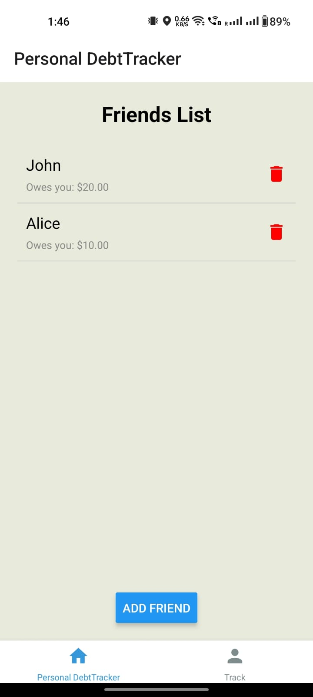
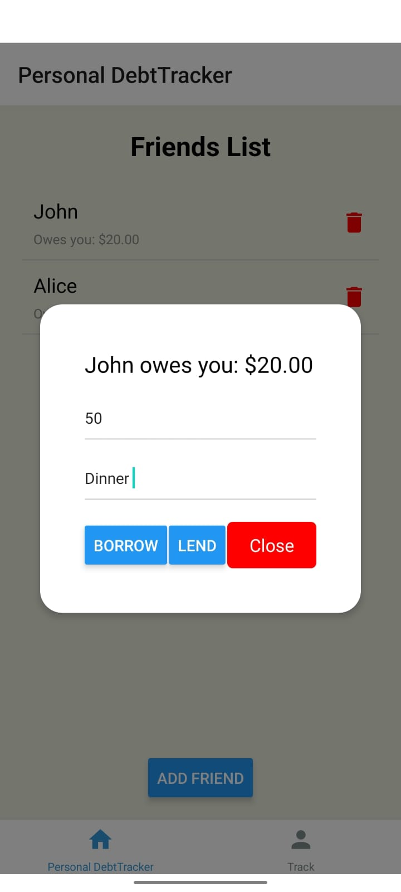
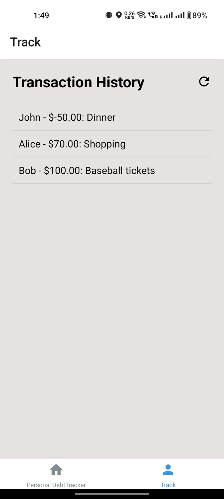

# DebtTracker

Repository URL: https://github.com/Sangeethsk01/My-Projects/tree/main/Personal_DebtTracker

## Description:
DebtTracker is a React Native mobile application designed to help users manage debts among friends. It facilitates tracking transactions, displaying debt balances, and maintaining a transaction history.

## Features:
1. **Home Screen:**
   - The Home screen presents a list of friends along with the amount owed or owed to each friend.
     
  
    

     
   - Users can add new friends, record borrowing or lending transactions, and delete friends as needed.

     

     

1. **Transactions Screen:**
   - The Transactions screen displays a scrollable list of all recorded transactions, including details such as the friend involved, transaction amount, and description.
   - Users can manually refresh the transaction list to see the most up-to-date information.
  
      

## Components:
1. **App.js:**
   - The main entry point of the application.
   - Configures navigation using `react-navigation`, setting up navigation between the Home and Transactions screens using `createBottomTabNavigator`.

2. **HomeScreen.js:**
   - Manages the friend list and related actions.
   - Allows users to add new friends via a modal input, record borrowing or lending transactions, and delete existing friends.
   - Utilizes state management with `useState` hooks to update the friend list and transaction records dynamically.

3. **Transactions.js:**
   - Displays the transaction history.
   - Uses the `useEffect` hook to update the transaction list when changes occur in the `transactionList` array.
   - Provides a refresh button to manually update the transaction list.

4. **transaction_list.js:**
   - Defines the `transactionList` array, which stores all recorded transactions.
   - Exported to be accessed by other components for adding, updating, and displaying transactions.

## Dependencies:
- `react-navigation`: Facilitates navigation between screens.
- `@expo/vector-icons`: Provides icon components for UI elements.
- `react-native`: Core library for building mobile applications using React.

## How it Works:
- Upon launching the application, users are greeted with the Home screen, where they can view their friend list and perform various actions such as adding new friends or recording transactions.
- The Transactions screen provides a comprehensive view of all past transactions, enabling users to track their financial interactions over time.
- Each transaction recorded is stored in the `transactionList` array, ensuring persistent data storage and retrieval across screens.
- Users can seamlessly navigate between screens using the tab-based navigation setup in `App.js`.

## Expo Go:
This project was simulated and tested using Expo Go, allowing easy access and testing of the application on iOS and Android devices.

## Contributors:
- Sangeeth Kumar Kotagiri (kotagisr@mail.uc.edu)
- Venkata Sai Chandan Bobbili (bobbilvn@mail.uc.edu)
- Venna Sai Kiran Reddy (vennasy@mail.uc.edu)
